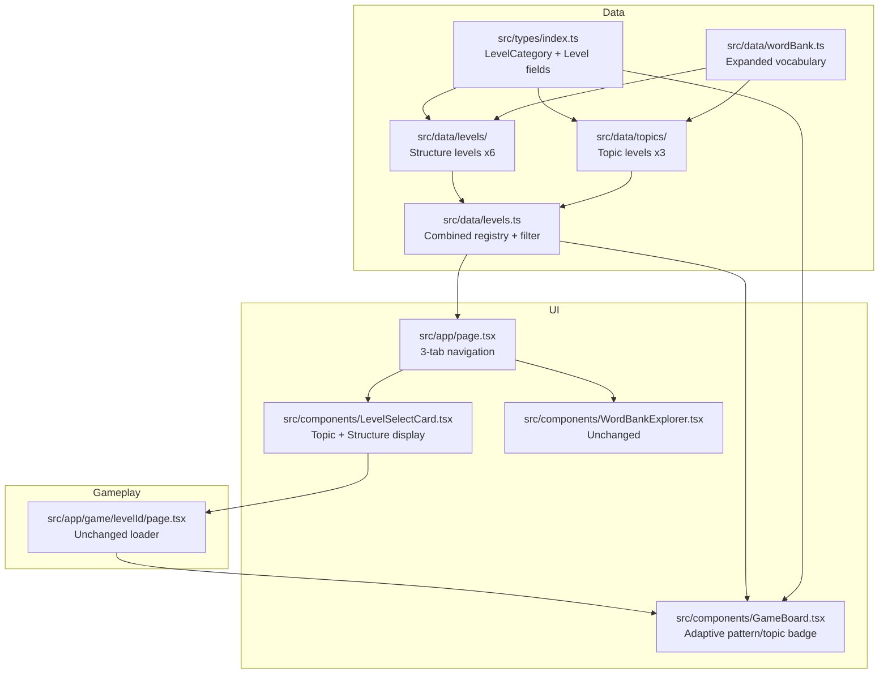

# Three-Tab System: Sentence Structures, Topics & Word Bank

## Overview

Restructure the home page into three tabs and add topic-based levels with mixed sentence structures. All levels (structure + topic) are unlocked from the start.

## Architecture Changes

### 1. Data Model (`src/types/index.ts`)

Add a `LevelCategory` type and extend `Level`:

```typescript
export type LevelCategory = "structure" | "topic";

// Add to Level interface:
export interface Level {
  id: string;
  name: string;
  description: string;
  category: LevelCategory;       // NEW — identifies tab
  topic?: string;                 // NEW — e.g. "School", "Shopping" (for topic levels)
  pattern: SentencePattern;
  sentences: SentenceItem[];
  unlockCondition?: string;       // Keep for backward compat but no longer used
  starThresholds: [number, number, number];
}
```

Existing structure levels get `category: "structure"`. New topic levels get `category: "topic"` and a `topic` value.

### 2. Word Bank Expansion (`src/data/wordBank.ts`)

Add vocabulary needed for the three topic levels. New entries marked with `// NEW`:

**Subjects:** No additions needed (我, 你, 他, 她, etc. cover all topics)

**Verbs — add:**
- 穿 (chuān) — wear
- 卖 (mài) — sell
- 教 (jiāo) — teach
- 住 (zhù) — live
- 买 (already exists)

**Objects — add:**
- 衣服 (yī fu) — clothes
- 裤子 (kù zi) — pants
- 鞋子 (xié zi) — shoes
- 衬衫 (chèn shān) — shirt
- 裙子 (qún zi) — skirt
- 书包 (shū bāo) — schoolbag / backpack
- 铅笔 (qiān bǐ) — pencil
- 课 (kè) — class / lesson
- 商店 (already exists as place — also needed as object)

**Adjectives — add:**
- 便宜 (pián yi) — cheap
- 贵 (guì) — expensive
- 新 (xīn) — new
- 旧 (jiù) — old (worn)

**Nouns — add:**
- 售货员 (shòu huò yuán) — shop assistant / salesperson
- 同学 (already exists)
- 老师 (already exists)
- 学生 (already exists)

**Places — add:**
- 超市 (chāo shì) — supermarket
- 食堂 (shí táng) — cafeteria
- 图书馆 (tú shū guǎn) — library
- 教室 (jiào shì) — classroom
- 宿舍 (sù shè) — dormitory

### 3. Topic Level Data Files

New directory: `src/data/topics/`

Each topic file exports a `Level` object with `category: "topic"`, `topic: "School"` (etc.), and sentences using MIXED patterns.

**Sentence structure rules for topic levels:**
- Within a single topic level, each sentence can have a DIFFERENT pattern (number of slots, order of parts)
- The `pattern` field is still required but set to a generic "Mixed" pattern for fallback display
- The slot labels come from `currentSentence.parts[n].partOfSpeech`, not from `pattern.structure[n]` — so each sentence correctly labels its own slots
- Fixed slot detection (`isSlotFixed`) is checked per level across ALL sentences — for mixed levels, no slots will be "fixed" because sentences vary in structure, which is fine

#### File: `src/data/topics/topic-school.ts`
- 6–8 sentences mixing patterns: SVO, S+是+N, S+很+Adj, S+要+V+O, Time+S+V+O
- Vocabulary: 老师, 学生, 书, 学, 看, 写, 作业, 教室, 图书馆, 宿舍, etc.
- Examples: 我是学生, 我学中文, 老师很好看, 我要看书, 早上我在教室学中文

#### File: `src/data/topics/topic-shopping.ts`
- 6–8 sentences mixing patterns
- Vocabulary: 买, 卖, 商店, 超市, 钱, 东西, 贵, 便宜, 水果, etc.
- Examples: 我买苹果, 这个很贵, 他要去商店, 昨天我买了水果

#### File: `src/data/topics/topic-clothing.ts`
- 6–8 sentences mixing patterns
- Vocabulary: 穿, 衣服, 裤子, 鞋子, 衬衫, 裙子, 大, 小, 漂亮, 新, 旧, etc.
- Examples: 我穿衣服, 这件衬衫很漂亮, 她要买新鞋子, 我的裤子很大

### 4. Level Registry (`src/data/levels.ts`)

- Import and export both `allStructureLevels` (existing) and `allTopicLevels` (new)
- Keep `getLevelById()`, `getLevels()`, etc. returning ALL levels
- Add `getLevelsByCategory(category: LevelCategory)` for filtering

```typescript
export function getLevelsByCategory(category: LevelCategory): Level[] {
  return allLevels.filter((l) => l.category === category);
}
```

### 5. GameBoard Updates (`src/components/GameBoard.tsx`)

**Two key changes:**

1. **Pattern badge display** — show "Pattern: XYZ" for structure levels, show "Topic: XYZ" for topic levels:
```tsx
<span className="text-xs font-medium text-indigo-500 bg-indigo-50 px-3 py-1 rounded-full">
  {state.level.category === "topic"
    ? `Topic: ${state.level.topic}`
    : `Pattern: ${state.level.pattern.name}`
  }
</span>
```

2. **Fixed slot detection** — the `isSlotFixed` function checks if ALL sentences share the same value at a slot index. For mixed-structure levels, sentences have varying lengths/structures, so `getFixedSlotIndices` may need to be resilient to out-of-bounds. Add a bounds check:
```typescript
function isSlotFixed(level: Level, partIndex: number): boolean {
  if (!level || level.sentences.length === 0) return false;
  // For levels with mixed structures, sentences may have different slot counts
  const sentencesWithIndex = level.sentences.filter(s => s.parts.length > partIndex);
  if (sentencesWithIndex.length < level.sentences.length) return false; // not all sentences have this slot
  const firstVal = sentencesWithIndex[0].parts[partIndex]?.chinese;
  if (!firstVal) return false;
  return sentencesWithIndex.every(s => s.parts[partIndex]?.chinese === firstVal);
}
```

### 6. LevelSelectCard Updates (`src/components/LevelSelectCard.tsx`)

- **Accept `category` prop** — derive from level data or pass explicitly
- **Display logic**:
  - Structure levels: show pattern name + level number badge (like today)
  - Topic levels: show topic name + topic icon/emoji badge
- **Remove locked UI state** — since all levels are now unlocked, no more locked card rendering. Instead, show all cards as playable.
- **Header content**:
  - Structure: `Level {n}` badge + pattern name subtitle
  - Topic: Topic emoji badge + "Topic" subtitle

```tsx
// Level number vs topic emoji
{level.category === "topic" ? (
  <span className="text-lg">{topicEmojis[level.topic || ""] || "📚"}</span>
) : (
  <span className="text-lg font-bold text-indigo-600">{levelNumber}</span>
)}

// Subtitle line
{level.category === "topic" ? (
  <p className="text-xs text-slate-500">Topic</p>
) : (
  <p className="text-xs text-slate-500">{level.pattern.name}</p>
)}
```

Topic emoji mapping (stored inline or as a constant):
- School: 🏫
- Shopping: 🛒
- Clothing: 👕

### 7. Home Page Tab Navigation (`src/app/page.tsx`)

**Three tabs instead of two:**
- "Sentence Structures" (structure category levels)
- "Topics" (topic category levels)
- "Word Bank" (existing)

**Tab state:** `"structures" | "topics" | "wordbank"`

**Remove unlock logic:**
- Delete `isLevelUnlocked()` function entirely
- Delete `STARS_UNLOCK_THRESHOLD` constant
- Always pass `unlocked: true` to LevelSelectCard

**Stats bar update:**
Current stats show "6 Levels, 27 Sentences, 6 Patterns". Update to reflect both structure and topic levels:
- Total levels (structure + topic)
- Total sentences
- Total patterns (still the 6 structure patterns)
- Total topics

**Tab rendering pattern:**
```tsx
{activeTab === "structures" && (
  <>
    <h2 className="text-xl font-bold text-slate-800 mb-6">Sentence Structures</h2>
    <p className="text-sm text-slate-500 mb-6">Learn fundamental Chinese sentence patterns</p>
    <div className="grid grid-cols-1 sm:grid-cols-2 lg:grid-cols-3 gap-4">
      {structureLevels.map(level => (...))}
    </div>
  </>
)}
{activeTab === "topics" && (
  <>
    <h2 className="text-xl font-bold text-slate-800 mb-6">Topics</h2>
    <p className="text-sm text-slate-500 mb-6">Practice with themed vocabulary in real-world contexts</p>
    <div className="grid grid-cols-1 sm:grid-cols-2 lg:grid-cols-3 gap-4">
      {topicLevels.map(level => (...))}
    </div>
  </>
)}
{activeTab === "wordbank" && (
  <>
    <h2 className="text-xl font-bold text-slate-800 mb-6">Word Bank</h2>
    <WordBankExplorer />
  </>
)}
```

### 8. API Layer (`src/lib/api.ts`)

- No significant changes needed
- `fetchLevels()` still returns all levels — filtering happens in the component
- Progress tracking (localStorage) remains the same — stars/scores are tracked per level ID

### 9. Game Page (`src/app/game/[levelId]/page.tsx`)

- No structural changes — it already loads any level by ID
- Topic levels will load and play identically since each sentence carries its own `parts` array with pinyin/english/partOfSpeech

## Implementation Order

### Phase 1 — Data Model
Files: `src/types/index.ts`
- Add `LevelCategory` type
- Add `category` and `topic` fields to `Level`

### Phase 2 — Word Bank Expansion
Files: `src/data/wordBank.ts`
- Add new vocabulary entries across multiple parts of speech

### Phase 3 — Topic Level Data
Files: `src/data/topics/topic-school.ts`, `src/data/topics/topic-shopping.ts`, `src/data/topics/topic-clothing.ts`
- Create three topic level files with mixed sentence structures

### Phase 4 — Level Registry
Files: `src/data/levels.ts`
- Import and export topic levels
- Add `getLevelsByCategory()` function

### Phase 5 — GameBoard Adaptation
Files: `src/components/GameBoard.tsx`
- Conditional pattern/topic display
- Defensive fixed-slot detection for mixed structures

### Phase 6 — LevelSelectCard Update
Files: `src/components/LevelSelectCard.tsx`
- Support topic display mode
- Remove locked-state rendering

### Phase 7 — Home Page Tab Restructure
Files: `src/app/page.tsx`
- Three tabs
- Remove unlock logic
- Filter levels by active tab
- Updated stats

### Phase 8 — Verification
- Start dev server
- Navigate all three tabs
- Play a structure level — verify badges, labels, gameplay
- Play a topic level — verify topic badge, mixed sentences, gameplay
- Check Word Bank tab still works

## Mermaid Diagram



## Questions & Decisions Made

| Question | Decision |
|----------|----------|
| Topic level structure? | Mixed sentence patterns per level |
| Unlock mechanism? | All levels unlocked at all times |
| Initial topics? | School, Shopping, Clothing |
| Slot labels for mixed levels? | Already uses `currentSentence.parts[n].partOfSpeech` — works automatically |
| Fixed slot detection for mixed levels? | Add defensive bounds check; mixed levels will have no fixed slots |
