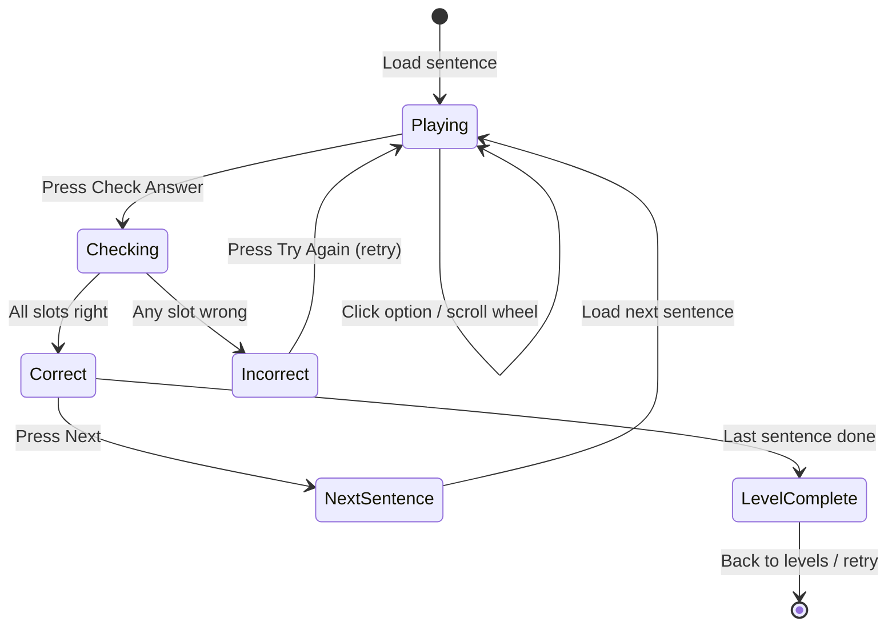

# HanziSlot UI Enhancement Plan

## Overview

The user wants three main improvements to the HanziSlot game UI:

1. **Slot machine redesign** — Replace current up/down arrows + pill buttons with a visual "wheel of options" that scrolls
2. **Bigger Hanzi font** — Make Chinese characters large and the main visual focus
3. **Better answer feedback** — Clearly highlight correct (green) and incorrect (red) slots with a retry flow

---

## Current vs. Proposed Design

### Current SlotColumn (`src/components/SlotColumn.tsx:81-196`)

```
┌─────────────────┐
│    [Subject]     │  ← small label
│        ▲         │  ← up arrow button
│   ┌─────────┐    │
│   │   我     │    │  ← small card (text-lg, ~1.125rem)
│   └─────────┘    │
│        ▼         │  ← down arrow button
│   wǒ (I/me)      │  ← tiny pinyin/english
│   [你] [他] [它]  │  ← tiny clickable pills
└─────────────────┘
```

### Proposed SlotColumn

```
┌─────────────────────┐
│      Subject        │  ← label, slightly bigger
├─────────────────────┤
│       ┌───┐         │
│       │ 你 │         │  ← dimmed, partially visible
│       └───┘         │
│   ┌─────────┐       │
│   │   我    │       │  ★ SELECTED — large (text-5xl, ~3rem)
│   │   wǒ    │       │  ★ pinyin visible below
│   └─────────┘       │
│       ┌───┐         │
│       │ 他 │         │  ← dimmed, partially visible
│       └───┘         │
├─────────────────────┤
│   I / me            │  ← english meaning
└─────────────────────┘
```

---

## Detailed Changes

### File 1: `src/components/SlotColumn.tsx` — Complete Redesign

**What changes:**
- Replace up/down arrow buttons with a vertical wheel/carousel
- Show 3 options vertically: previous (dimmed), selected (large & centered), next (dimmed)
- Hanzi font size: `text-5xl` (~3rem) for selected, `text-2xl` (~1.5rem) for adjacent items
- Selected option has a prominent border frame and subtle glow
- Clicking any option scrolls the wheel to center that option
- After answer check (`hasBeenChecked = true`):
  - Correct: green border (`border-green-500`), green background tint, subtle green glow
  - Incorrect: red border (`border-red-500`), red background tint, subtle red glow
- Pinyin shown directly below the selected hanzi in smaller text
- English meaning shown at the bottom of the column
- The wheel animates smoothly with Framer Motion spring transitions
- PoS label styled as a small badge/pill above the column

**Animations:**
- `AnimatePresence` with `mode="popLayout"` for smooth transitions between options
- Spring physics: `stiffness: 300, damping: 30` for a bouncy slot-machine feel
- Glow pulse animation on selected option

**Props interface — unchanged:**
```typescript
interface SlotColumnProps {
  options: string[];
  selectedIndex: number;
  label: string;
  partOfSpeech: PartOfSpeech;
  isCorrect: boolean | null;
  hasBeenChecked: boolean;
  pinyin: string;
  english: string;
  onSelect: (option: string) => void;
  disabled?: boolean;
}
```

**States to handle:**
| State | Visual |
|-------|--------|
| Default (unchecked) | Indigo border + bg, large hanzi centered |
| Correct | Green border + bg + glow, checkmark icon |
| Incorrect | Red border + bg + glow, x icon |
| Disabled (after check) | Reduced opacity, no hover effects |

---

### File 2: `src/components/GameBoard.tsx` — Layout Adjustments

**What changes:**
- Increase gap between slot columns to accommodate larger cards
- Remove the sentence preview panel (the "Your sentence:" box) — selected words are already visible in the slot wheels
- Make the "Check Answer" button more prominent
- The result overlay flow remains the same (already supports retry)

**Layout changes (lines 88-115):**
```typescript
// Current:
<div className="flex flex-wrap justify-center gap-4 md:gap-8 mb-8">

// Change to:
<div className="flex flex-wrap justify-center gap-6 md:gap-10 mb-10">
```

- Remove the sentence preview section (lines 107-115)
- Button text update: "Check Answer" stays, remove the "Answered ✓" state

---

### File 3: `src/app/globals.css` — Add Wheel Animations

**Add new keyframes:**
- `@keyframes slot-wheel-spin` — continuous subtle rotation for visual flair
- `@keyframes correct-glow` — green glow pulse for correct slots
- `@keyframes incorrect-shake` — subtle shake animation for incorrect slots

---

## Component Tree (Affected)

```
GamePage (src/app/game/[levelId]/page.tsx)
  └── GameProvider (src/context/GameContext.tsx)
        └── GameBoard (src/components/GameBoard.tsx)  ← MODIFY
              ├── EnglishSentence (no changes)
              ├── SlotColumn × N (src/components/SlotColumn.tsx)  ← REWRITE
              ├── ResultOverlay (no changes)
              └── LevelCompleteOverlay (no changes)
```

---

## Data Flow — Unchanged

No changes to:
- `src/engine/gameReducer.ts` — state management stays the same
- `src/engine/validation.ts` — answer validation stays the same
- `src/engine/shuffle.ts` — option shuffling stays the same
- `src/context/GameContext.tsx` — context API stays the same
- `src/types/index.ts` — type definitions stay the same

All the existing behavior for confirming answers, checking correctness, retrying sentences, and advancing to the next sentence remains intact.

---

## Implementation Order

1. **`src/components/SlotColumn.tsx`** — Redesign the slot column with the wheel UI, larger fonts, and green/red highlighting
2. **`src/app/globals.css`** — Add new animation keyframes for wheel glow/shake effects
3. **`src/components/GameBoard.tsx`** — Adjust layout spacing, remove sentence preview, clean up

---

## Mermaid Diagram: Slot Column State Flow



---

## Edge Cases

- **Single-option slots**: If a slot has only 1 option (no distractors), the wheel shows just that option with no scrolling possible
- **Two-option slots**: Show selected + the other dimmed above/below
- **Disabled state after check**: Clicking is disabled, but colors clearly show correct/incorrect
- **Mobile responsiveness**: Columns stack vertically on narrow screens, each wheel is full-width
