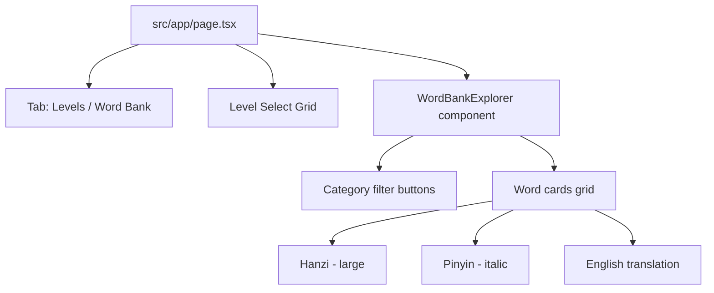

# Word Bank Explorer Tab Plan

## Overview

Add a vocabulary explorer tab to the home page where users can browse words by part of speech category. The word bank data already exists in [`src/data/wordBank.ts`](src/data/wordBank.ts) — this is purely a UI addition.

## Design

Two tabs at the top of the content area: **"Levels"** (default, existing) and **"Word Bank"** (new).

The Word Bank tab shows category buttons (pill-style) for each part of speech used in the game:

| Category | Words Available |
|----------|---------------|
| Subjects | 8 |
| Verbs | 10 |
| Objects | 17 |
| Adjectives | 10 |
| Nouns | 7 |
| Time | 6 |
| Places | 4 |
| Negation | 2 |
| Modals | 4 |
| Particles | 2 |
| Adverbs | 3 |

Each word is displayed in a card with:
- Large hanzi character
- Pinyin below
- English translation

## Files to Create/Modify

### New: [`src/components/WordBankExplorer.tsx`](src/components/WordBankExplorer.tsx)

A new component with:
- State for the active category (`PartOfSpeech`)
- Category filter buttons at the top
- Grid of word cards, filtered by selected category

```tsx
"use client";

import { useState } from "react";
import { PartOfSpeech } from "@/types";
import { wordBank } from "@/data/wordBank";

// Ordered by relevance to gameplay — common categories first
const categoryOrder: PartOfSpeech[] = [
  "subject", "verb", "object", "adjective", "noun",
  "time", "place", "negation", "modal", "particle", "adverb"
];

const categoryLabels: Record<PartOfSpeech, string> = {
  subject: "Subjects",
  verb: "Verbs",
  object: "Objects",
  adjective: "Adjectives",
  noun: "Nouns",
  time: "Time",
  place: "Places",
  negation: "Negation",
  modal: "Modals",
  particle: "Particles",
  adverb: "Adverbs",
};

export default function WordBankExplorer() {
  const [activeCategory, setActiveCategory] = useState<PartOfSpeech>("subject");

  const words = wordBank[activeCategory];

  return (
    <div>
      {/* Category filter pills */}
      <div className="flex flex-wrap gap-2 mb-6">
        {categoryOrder.map((cat) => (
          <button
            key={cat}
            onClick={() => setActiveCategory(cat)}
            className={`
              px-3 py-1.5 rounded-full text-sm font-medium transition-colors
              ${activeCategory === cat
                ? "bg-indigo-500 text-white"
                : "bg-slate-100 text-slate-600 hover:bg-slate-200"
              }
            `}
          >
            {categoryLabels[cat]}
            <span className="ml-1 text-xs opacity-60">({wordBank[cat].length})</span>
          </button>
        ))}
      </div>

      {/* Word cards grid */}
      <div className="grid grid-cols-2 sm:grid-cols-3 md:grid-cols-4 lg:grid-cols-5 gap-3">
        {words.map((entry) => (
          <div
            key={entry.chinese}
            className="bg-white rounded-xl border border-slate-200 p-4 text-center hover:border-indigo-300 hover:shadow-sm transition-all"
          >
            <p className="text-3xl font-black font-chinese text-indigo-700 mb-1">
              {entry.chinese}
            </p>
            <p className="text-sm text-slate-500 italic">{entry.pinyin}</p>
            <p className="text-xs text-slate-400 mt-0.5">{entry.english}</p>
          </div>
        ))}
      </div>
    </div>
  );
}
```

### Modified: [`src/app/page.tsx`](src/app/page.tsx)

Add tab state and toggle between Levels and Word Bank views:

```tsx
const [activeTab, setActiveTab] = useState<"levels" | "wordbank">("levels");

// Tab bar above content
<div className="max-w-4xl mx-auto px-4 pt-8">
  <div className="flex gap-1 bg-slate-100 rounded-xl p-1 w-fit mb-6">
    <button onClick={() => setActiveTab("levels")} className="...">
      🎮 Levels
    </button>
    <button onClick={() => setActiveTab("wordbank")} className="...">
      📖 Word Bank
    </button>
  </div>
  
  {activeTab === "levels" ? (
    // existing level grid
  ) : (
    <WordBankExplorer />
  )}
</div>
```

## Data Flow

No changes to game state, reducers, or API. The word bank is a static data file — no loading or persistence needed.

## Mermaid: Component Structure


